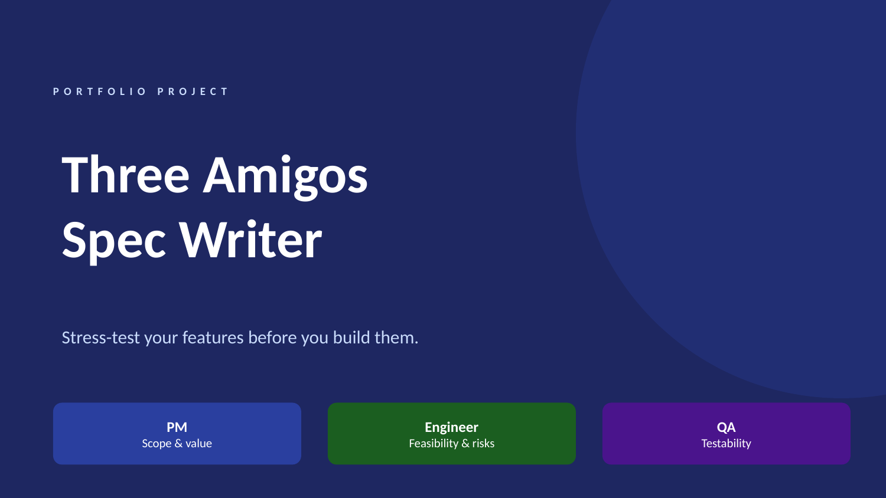
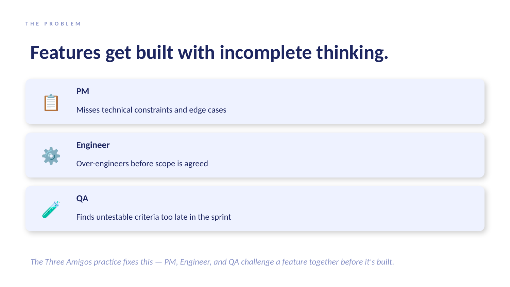
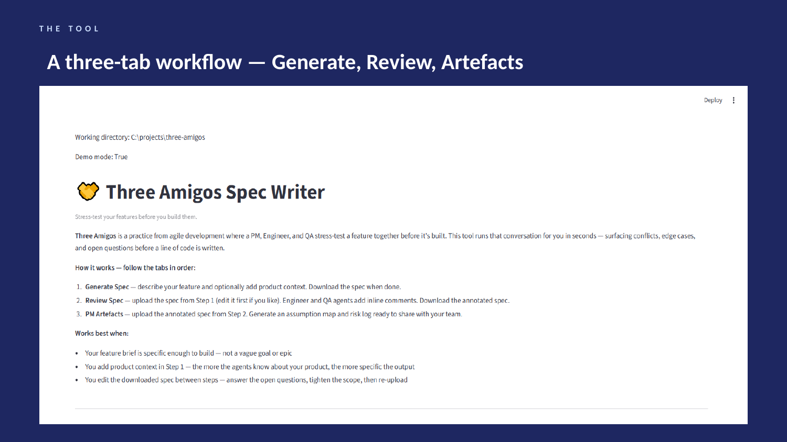
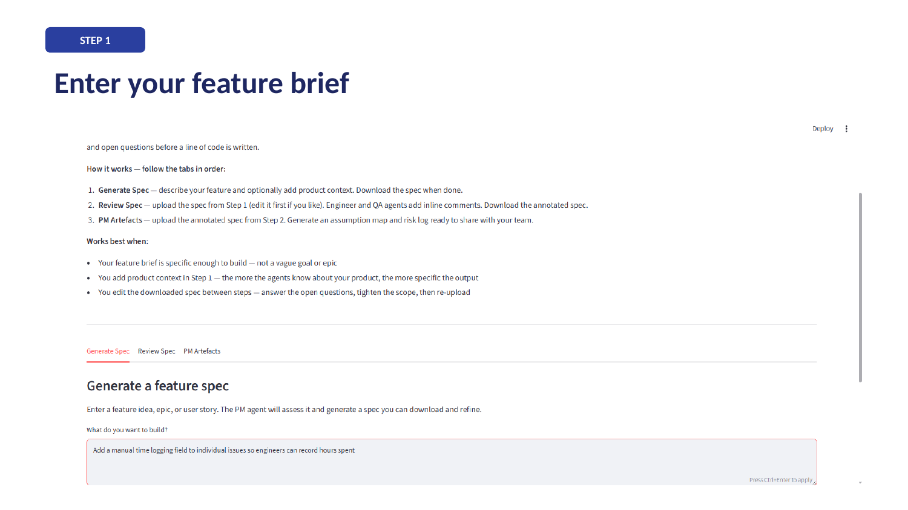
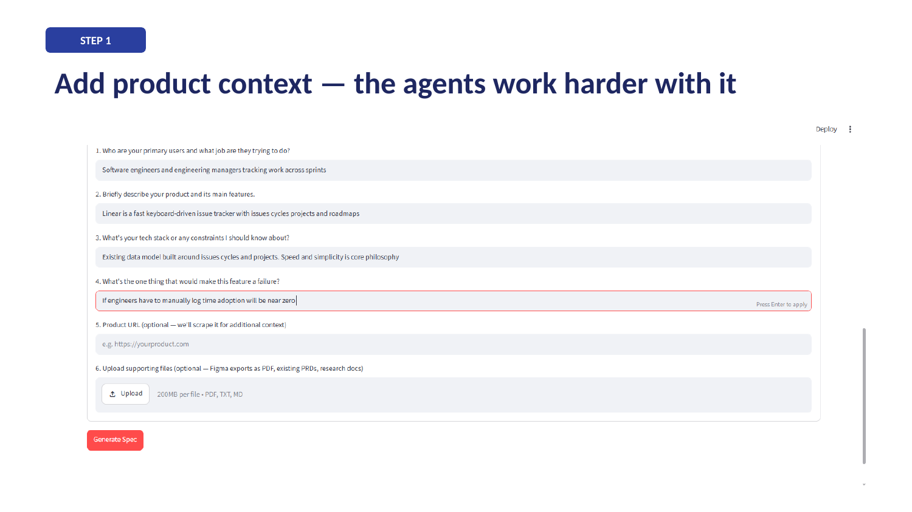
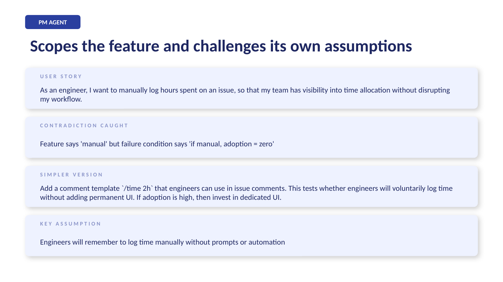
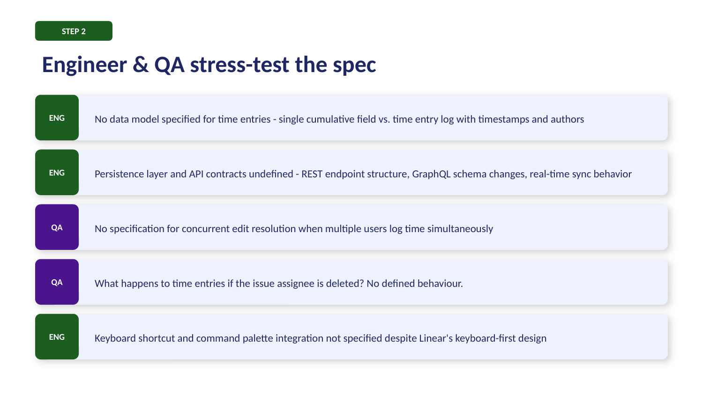
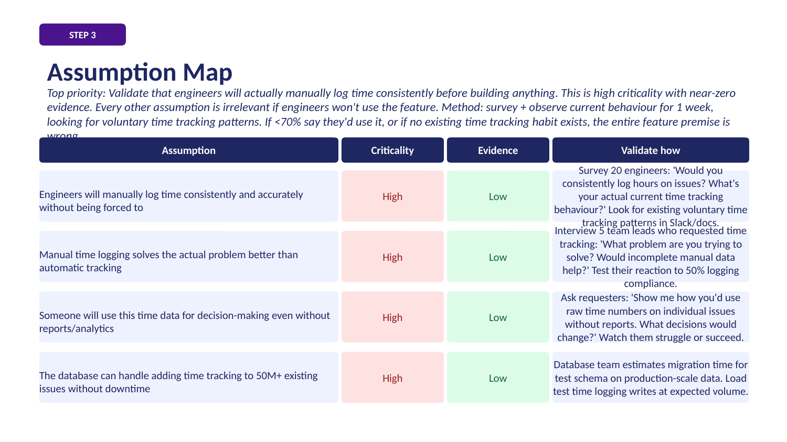
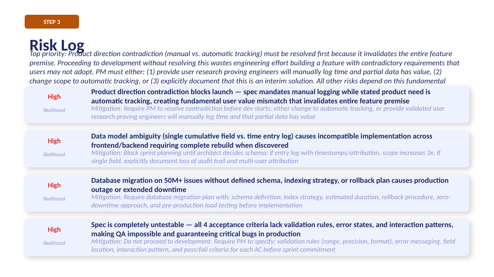
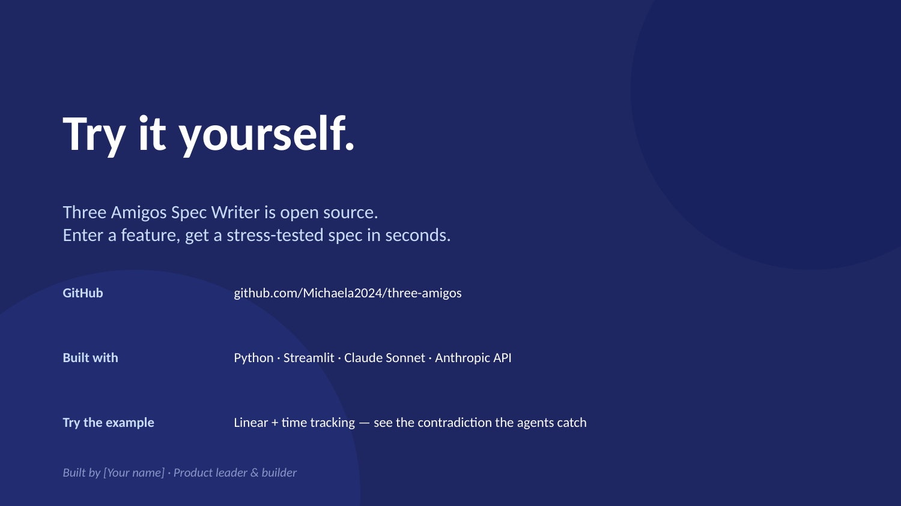

# 🤝 Three Amigos Spec Writer

> Stress-test your features before you build them.

**Three Amigos** is a practice from agile development where a PM, Engineer, and QA challenge a feature together before it's built. Most teams do this badly or skip it entirely. This tool runs that conversation in seconds — surfacing conflicts, edge cases, and open questions before a line of code is written.

---

## What it does

You describe a feature. Three AI agents — each with a distinct adversarial perspective — stress-test it from different angles. The result is a structured spec that honestly represents where the agents agree, where they conflict, and what a human needs to decide before building starts.

**The three agents:**

| Agent | Job |
|-------|-----|
| **PM** | Scopes the feature, defines the user story, success metrics, and what's explicitly out of scope. Challenges its own assumptions and asks what the simplest version would be. |
| **Engineer** | Finds what's missing, ambiguous, or likely to cause a failed sprint. Raises technical risks, edge cases, and decisions that must be made before building starts. |
| **QA** | Makes the spec testable or declares it untestable. Finds every place two developers would build different things and both claim to be correct. |

---

## How to use it

Follow the three tabs in order. The output of each tab is the input for the next.

### Tab 1 — Generate Spec
Describe your feature in one or two sentences. Optionally add product context by answering four questions, pasting a product URL, or uploading a PDF (Figma exports, existing PRDs, research docs). The PM agent assesses the input and generates a structured spec. Download it, edit it — answer the open questions, tighten the scope — then move to Tab 2.

### Tab 2 — Review Spec
Upload the spec from Tab 1. Choose Engineer, QA, or both. Each agent reviews the spec and returns it with inline comments — `[ENGINEER]` and `[QA]` tags surfacing challenges and untestable criteria. Download the annotated spec.

### Tab 3 — PM Artefacts
Upload the reviewed spec. Generate an assumption map, a risk log, or both. Download them as markdown tables ready to share with your team.

**Works best when:**
- Your feature brief is specific enough to build — not a vague goal or epic
- You add product context — the more the agents know about your product, the more specific the output
- You edit the downloaded spec between steps — the tool is a starting point, not a finished document

---

## Try this example

Linear is a fast, keyboard-driven issue tracker that deliberately avoids feature bloat. Time tracking is a feature their users frequently request — and Linear has consistently declined to build it. It's a genuinely controversial product decision that produces interesting agent tension.

## Demo

The walkthrough below shows the full pipeline running on the Linear example — from feature brief to assumption map and risk log.












**Feature brief:**
```
Add a manual time logging field to individual issues so engineers can record hours spent
```

**Product context:**

| Question | Answer |
|----------|--------|
| Who are your primary users? | Software engineers and engineering managers tracking work across sprints |
| Describe your product | Linear is a fast, keyboard-driven issue tracker with issues, cycles, projects and roadmaps — known for speed and minimal UI |
| Tech stack / constraints | Existing data model built around issues, cycles and projects. Product philosophy is speed and simplicity — any new feature must not slow down the core workflow |
| What would make this a failure? | If engineers have to manually log time rather than it being automatic, adoption will be near zero. Also if it adds clutter to the issue view. |
| Product URL | https://linear.app |

The PM agent will detect the contradiction between "manual logging" and "adoption will be near zero if manual." The Engineer will surface data model and concurrency decisions. QA will find that "standard time formats" is entirely untestable as written.

---

## Installation

**Prerequisites:** Python 3.9+, an Anthropic API key

```bash
git clone https://github.com/Michaela2024/three-amigos
cd three-amigos
python -m venv venv
venv\Scripts\activate  # Windows
source venv/bin/activate  # Mac/Linux
pip install -r requirements.txt
```

Create a `.env` file in the project root:

```
ANTHROPIC_API_KEY=your-key-here
```

Run the app:

```bash
streamlit run app.py
```

---

## Design decisions

These are the choices made during development and why — the interesting ones, not the obvious ones.

### 1. Two-shot pipeline, not one-shot
The PM agent always runs first as an assessment step. The user sees the output and decides whether to continue. Engineer and QA run in a second step against the PM's structured output — not the raw input.

**Why:** Engineer and QA need something structured to challenge. Passing a one-line feature brief directly to an Engineer agent produces generic challenges. Passing a PM-structured output with explicit scope, assumptions, and a simpler version gives the Engineer something real to push back on.

### 2. The user doesn't classify their input
A PM shouldn't need to know whether they're writing an epic, a feature, or a user story. The PM agent detects it and responds accordingly — if the input is too broad, it breaks it down into candidate features and recommends where to start.

**Why:** The tool meets the user where they are. Forcing classification adds friction and assumes knowledge the user may not have.

### 3. Agents are adversarial by design
Each agent is explicitly prompted to find problems, not validate thinking. The Engineer prompt says: "Your job is NOT to complete the spec. Your job is to find what is missing, ambiguous, or likely to cause a failed sprint." The QA prompt says: "Find every place two developers would build different things and both claim to be correct."

**Why:** LLMs default to agreement. Claude is trained to be helpful, which means it pattern-matches to constructive, optimistic responses. Without explicit adversarial framing, the agents summarise and validate rather than challenge. Sycophancy has to be engineered out, it doesn't disappear on its own.

### 4. Synthesis preserves conflict, not consensus
The synthesis agent is explicitly told: "Your job is NOT to resolve disagreements. Your job is to preserve them as open questions." Confidence scores (1-5 per agent) are forced low by the prompt — a spec where all three agents score 4+ is a spec that isn't being honest.

**Why:** A spec that smooths over conflicts is worse than no spec. The value is in surfacing what the team needs to decide, not in producing a polished document that hides the hard questions.

### 5. Context is built, not written
Instead of asking PMs to paste context into a free-text box, the tool asks four targeted questions and synthesises the answers into a context block. A URL and PDF upload add additional signal.

**Why:** Most PMs don't know what context is useful to provide. Guided questions produce consistent, useful context. A free-text box produces either nothing or an unstructured dump that the agents can't use effectively.

### 6. Caching saves API costs during development
All agent calls are wrapped in `@st.cache_data`. The same input returns the same output without an API call.

**Why:** During development you run the same features dozens of times. Without caching, a full pipeline run costs ~$0.10-0.15 every time. With caching, repeated runs are free. The cache is cleared on each new "Generate Spec" click to ensure fresh results in production use.

### 7. Streamlit, not a polished frontend
The UI is built in Streamlit — a Python framework that renders UI from function calls, with no HTML or CSS required.

**Why:** This is a tool, not a product. Streamlit signals that honestly. A polished React frontend would imply a level of product maturity that isn't here yet. Streamlit also allows progressive rendering — each agent's output appears as it completes, which is important for a pipeline that takes 30-60 seconds end to end.

### 8. Markdown download at every step
Every output is downloadable as a single markdown file that pastes cleanly into Notion, Confluence, or a GitHub issue without editing.

**Why:** PMs live in those tools. The spec is only useful if it gets into the team's workflow. A markdown file has zero friction — it renders everywhere and requires no special tooling.

### 9. The three roles are PM, Engineer, and QA — not PM, Engineer, Customer
The classic Three Amigos practice uses PM, Engineer, and QA/Tester. An earlier version used a "Customer" persona but it was replaced with QA.

**Why:** A Customer persona produces accessibility-level insights — "what does the confused user want?" QA produces testability insights — "how would you verify this?" The second is more actionable and more accurate to the practice the tool is named after. A PM reading a QA challenge knows exactly what to do with it.

---

## What's next

**URL scraping improvements** — the current scraper strips HTML and takes the first 2000 characters. A smarter scraper would identify the most relevant sections (pricing, features, about) and weight them accordingly.

**MCP server** — the logical next step is exposing the agents as callable tools via the Model Context Protocol. A PM in Claude.ai with Linear and Three Amigos both connected could say "spec out this Linear ticket" and get a full output written back to the ticket automatically. The tool lives where the context already is.

**Assumption validation agent** — when confidence scores are low across all three agents, a fifth agent could generate a research plan: what to learn before building, who to talk to, and the cheapest way to validate each blocking assumption.

**Human-in-the-loop mode** — allow the PM to respond to each agent's challenges before the next agent runs. Closer to how a real Three Amigos session works.

---

## What I learned

Built over three weekends as a portfolio project. Key findings:

- **Sycophancy is structural, not accidental.** You can't fix it with "be critical." You have to change the agent's frame — give it a job that requires finding problems, not a persona that's allowed to find them.
- **Context changes everything.** The same feature brief with and without product context produces fundamentally different output. The agents aren't just generating text — they're reasoning about a specific product with specific constraints.
- **The synthesis agent is the hardest prompt to write.** Getting it to preserve conflict rather than resolve it required explicit instruction and low confidence scores as a forcing function.
- **Generic features work better than niche ones for demos.** The agents produce more legible tension on universally-understood features (notifications, search, time tracking) because the audience already has opinions to compare against.
- **The pipeline tells you when you're not ready to spec.** Low confidence scores across all three agents aren't a failure — they're the tool doing its job. Sometimes the right output is "do more discovery before writing a spec."

---

## Stack

- Python 3.11
- [Streamlit](https://streamlit.io) — UI framework
- [Anthropic Python SDK](https://github.com/anthropic/anthropic-sdk-python) — Claude API
- [pdfplumber](https://github.com/jsvine/pdfplumber) — PDF text extraction
- [BeautifulSoup4](https://www.crummy.com/software/BeautifulSoup/) — URL scraping
- [python-docx](https://python-docx.readthedocs.io/) — Word document support
- Claude Sonnet (`claude-sonnet-4-5`) — all agent calls

---

*Built by Michaela Heigl · https://github.com/Michaela2024
